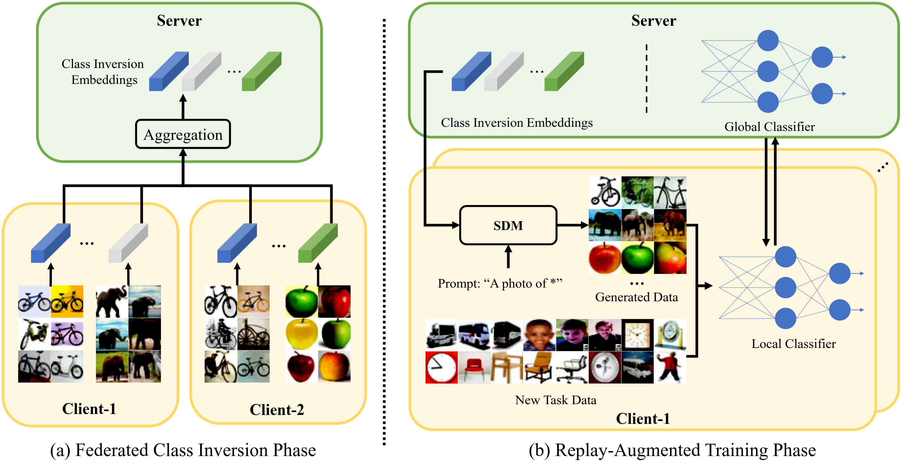

# Diffusion-Driven Data Replay: A Novel Approach to Combat Forgetting in Federated Class Continual Learning

 <p align='center'>
  <b>
    <a href="">Paper</a>
    |
    <a href="">Poster</a>
  </b>
</p> 

> **Diffusion-Driven Data Replay: A Novel Approach to Combat Forgetting in Federated Class Continual Learning**<br>
> Jinglin Liang<sup>1</sup>, Jin Zhong<sup>1</sup>, Hanlin Gu<sup>2</sup>, Zhongqi Lu<sup>3</sup>, Xingxing Tang<sup>2</sup>, Gang Dai<sup>2</sup>, Shuangping Huang<sup>1</sup>, Lixin Fan<sup>4</sup>, Qiang Yang<sup>2</sup> <br>
> <sup>1</sup>South China University of Technology (SCUT), <sup>2</sup>HKUST, <sup>3</sup>UPC, <sup>4</sup>WeBank

>**Abstract**: <br>
> Federated Class Continual Learning (FCCL) merges the challenges of distributed client learning with the need for seamless adaptation to new classes without forgetting old ones. The key challenge in FCCL is catastrophic forgetting, an issue that has been explored to some extent in Continual Learning (CL). However, due to privacy preservation requirements, some conventional methods, such as experience replay, are not directly applicable to FCCL. Existing FCCL methods mitigate forgetting by generating historical data through federated training of GANs or data-free knowledge distillation. However, these approaches often suffer from unstable training of generators or low-quality generated data, limiting their guidance for the model. To address this challenge, we propose a novel method of data replay based on diffusion models. Instead of training a diffusion model, we employ a pre-trained conditional diffusion model to reverse-engineer each category, searching the corresponding input conditions for each category within the model's input space, significantly reducing computational resources and time consumption while ensuring effective generation. Furthermore, we enhance the classifier's domain generalization ability on generated and real data through contrastive learning, indirectly improving the representational capability of generated data for real data. Extensive experiments demonstrate that our method significantly outperforms existing baselines.

<div style="display: flex; flex-direction: column; align-items: center; text-align: center; ">

</div>
<p align="center" style="margin-bottom: 10px;">
Overview of our DDDR
</p>

## 📢 Description
This repository is the official PyTorch implementation of:

[Diffusion-Driven Data Replay: A Novel Approach to Combat Forgetting in Federated Class Continual Learning]() (ECCV 2024).

## 🔨 Requirement
### Environment
```bash
pip install -r requirements.txt -f https://download.pytorch.org/whl/torch_stable.html
```
Then install CLIP from the official [CLIP](https://github.com/openai/CLIP) repository.

### Prepare Data
The program will automatically download the CIFAR-100 dataset. You only need to download the Tiny ImageNet dataset using the following commands.
```bash
cd data
wget http://cs231n.stanford.edu/tiny-imagenet-200.zip
unzip tiny-imagenet-200.zip
python preprocess.py
cd ..
```

## 🍔 Pre-trained Model
We use the pretrained diffusion model from [LDM](https://github.com/CompVis/latent-diffusion) repository, you can simply use the following command to obtain the pre-trained model.
```bash
mkdir -p models/ldm/text2img-large
wget -O models/ldm/text2img-large/model.ckpt https://ommer-lab.com/files/latent-diffusion/nitro/txt2img-f8-large/model.ckpt
```

Please download bert-base-uncased from [here](https://huggingface.co/google-bert/bert-base-uncased), and put it in models/bert.

## 🚀 Reproducing
Just set the GPU_LIST in [rep_run.sh](https://github.com/jinglin-liang/DDDR/blob/master/rep_run.sh) and run this command to easily reproduce most of the results from our paper.
```bash
bash rep_run.sh
```

You can also reproduce our method or baseline methods separately using the following commands.
```bash
# DDDR
python main.py --dataset cifar100 --method ours --tasks 5 --beta 0.5 --seed 2024

# Finetune
python main.py --dataset cifar100 --method finetune --tasks 10 --beta 0.5 --seed 2024

# EWC
python main.py --dataset cifar100 --method ewc --tasks 10 --beta 0.5 --seed 2024

# Target
python main.py --dataset cifar100 --method target --tasks 5  --beta 0.5 --seed 2024 --w_kd 25
```

## 🏰 Other related projects
- [Textual Inversion](https://github.com/rinongal/textual_inversion)
- [Target](https://github.com/zj-jayzhang/Federated-Class-Continual-Learning)

We would like to express our heartfelt gratitude for their contribution to our project.

## ❤️ Citation
If you find our work inspiring or use our codebase in your research, please cite our work:
```
@inproceedings{liang2024dddr,
  title={Diffusion-Driven Data Replay: A Novel Approach to Combat Forgetting in Federated Class Continual Learning},
  author={Liang, Jinglin and Zhong, Jin and Gu, Hanlin and Lu, Zhongqi and Tang, Xingxing and Dai, Gang and Huang, Shuangping and Fan, Lixin and Yang, Qiang},
  booktitle={ECCV},
  year={2024}
}
```